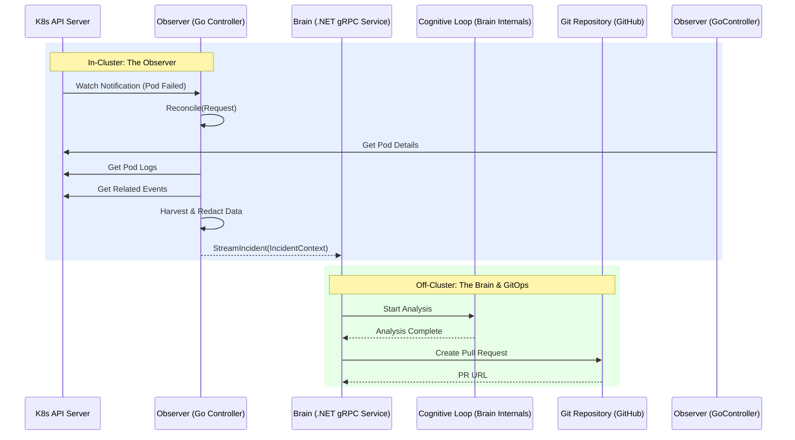

# Kube-Mind: The Autonomous SRE Platform

[](https://ci.example.com/build/status)

Kube-Mind is an AI-driven, two-part system that functions as an autonomous Level 1 Site Reliability Engineer for Kubernetes. It is designed to automatically detect, diagnose, and propose version-controlled fixes for common workload failures, transforming incident response from a manual, reactive process into a proactive, automated workflow.

## 📖 Table of Contents

- [Core Concepts](#-core-concepts)
- [Architectural Overview](#-architectural-overview)
- [The Cognitive Loop](#-the-cognitive-loop)
- [Getting Started](#-getting-started)
  - [Prerequisites](#prerequisites)
  - [Configuration](#configuration)
  - [Running the Platform](#running-the-platform)
- [Project Structure](#-project-structure)
- [Contributing](#-contributing)

## ✨ Core Concepts

The Kube-Mind platform is composed of two primary microservices that work in concert:

1.  **The Observer (Go):** A lightweight, read-only Kubernetes controller that resides within your cluster. It continuously watches for workload failures (e.g., `CrashLoopBackOff`, `OOMKilled`), harvests a rich set of diagnostic data (logs, manifests, events), redacts sensitive information, and securely streams an `IncidentContext` payload to the Brain.

2.  **The Brain (.NET):** A centralized AI orchestration service that acts as the cognitive core. It ingests data from Observers, uses **Microsoft Semantic Kernel** to reason about failures, queries a Redis vector database for historical context, and formulates a GitOps-native fix. Its primary output is a merge-ready **Pull Request** sent to a designated code repository.

## 🏗️ Architectural Overview

The entire system is designed around a principle of least privilege and uncompromising safety. The Observer has read-only access to the cluster, and the Brain **never** has direct write-access. All proposed changes must go through a standard, human-in-the-loop GitOps Pull Request workflow.

### End-to-End System Flow

This diagram illustrates the complete flow, from failure detection in the Kubernetes cluster to a proposed fix in a Git repository.



### The Cognitive Loop

The Brain operates on a continuous cognitive loop for each incident it receives:

```mermaid
sequenceDiagram
    participant Observer
    participant Brain (gRPC Server)
    participant Redis (Vector DB)
    participant Semantic Kernel (AI Orchestrator)
    participant LLM
    participant Tool Plugins
    participant Git Repository (GitHub)
    participant UI (SignalR)
    participant Slack/Teams

    Observer->>Brain (gRPC Server): Stream(IncidentContext)
    Brain (gRPC Server)->>Redis (Vector DB): IsDuplicate(IncidentId)?
    alt Incident is NOT duplicate
        Brain (gRPC Server)->>UI (SignalR): Stream("New Incident Received")
        Brain (gRPC Server)->>Redis (Vector DB): Search for similar incidents/runbooks
        Brain (gRPC Server)->>Semantic Kernel (AI Orchestrator): RunAnalysis(EnrichedContext)

        Semantic Kernel (AI Orchestrator)->>LLM (GPT-4o, etc.): Create Plan & Hypothesis
        LLM (GPT-4o, etc.)-->>Semantic Kernel (AI Orchestrator): Proposed Plan
        Semantic Kernel (AI Orchestrator)->>UI (SignalR): Stream("Plan: ...")

        loop Plan Execution (via Function Invocation Filter)
            Semantic Kernel (AI Orchestrator)->>Tool Plugins: ExecuteNextStep()
            Tool Plugins-->>Semantic Kernel (AI Orchestrator): StepResult
            Semantic Kernel (AI Orchestrator)->>UI (SignalR): Stream("Tool Output: ...")
        end

        Semantic Kernel (AI Orchestrator)->>LLM (GPT-4o, etc.): Formulate Remediation
        LLM (GPT-4o, etc.)-->>Semantic Kernel (AI Orchestrator): Proposed Code Change

        Semantic Kernel (AI Orchestrator)->>Tool Plugins: PolycheckPlugin.IsCodeChangeSafe(ProposedCodeChange)
        Tool Plugins-->>Semantic Kernel (AI Orchestrator): Safety Assessment ("YES" / "NO")

        alt Safety Assessment is "YES"
            Semantic Kernel (AI Orchestrator)->>Tool Plugins: GitOpsPlugin.CreateFixPullRequest(Details)
            Tool Plugins->>Git Repository (GitHub): Create Branch, Commit, Open PR
            Git Repository (GitHub)-->>Tool Plugins: PR URL
            Tool Plugins->>UI (SignalR): Stream("PR Created: url...")
            Tool Plugins->>Slack/Teams: Send Notification("PR Ready for Review")
        else Safety Assessment is "NO"
            Semantic Kernel (AI Orchestrator)->>UI (SignalR): Stream("🚫 Remediation Blocked: Safety check failed.")
            Semantic Kernel (AI Orchestrator)->>Slack/Teams: Send Alert("Automated remediation failed safety check")
        end
    else Incident is duplicate
        Brain (gRPC Server)->>UI (SignalR): Stream("Incident is a duplicate, skipping.")
    end
    Brain (gRPC Server)-->>Observer: StreamIncidentResponse

```

1.  **Ingest & Enrich:** A gRPC server receives the `IncidentContext`. It immediately queries a Redis vector database for semantically similar past incidents and relevant runbook snippets to enrich the data.
2.  **Reason & Plan:** The enriched context is passed to the Semantic Kernel, which uses an LLM to form a hypothesis and generate a step-by-step plan to verify it.
3.  **Execute & Gather:** The Kernel invokes the necessary C# functions (Plugins) to execute the plan, gathering more evidence until a diagnosis is confirmed.
4.  **Remediate & Propose:** Once the diagnosis is confirmed, the Kernel selects a remediation strategy and invokes the `GitOpsPlugin` to create a new branch, programmatically apply a fix (e.g., updating a Helm `values.yaml`), and open a Pull Request with a detailed summary.
5.  **Report & Stream:** Every step of the AI's "thought process"—the plan, each tool invocation, and the final conclusion—is streamed in real-time to a web UI via SignalR.

## 🚀 Getting Started

Follow these steps to get the Kube-Mind Brain running locally.

### Prerequisites

- [.NET 8 SDK](https://dotnet.microsoft.com/download/dotnet/8.0)
- [Go](https://go.dev/doc/install)
- [Docker](https://www.docker.com/products/docker-desktop/) (with Docker Compose)
- [Redis Stack](https://redis.io/docs/stack/) (for the Vector DB)
- `kubectl`
- A configured Kubernetes cluster (e.g., `kind`, `minikube`, or Docker Desktop's cluster)

### Configuration

The Brain service requires several configuration values to be set up.

1.  **Navigate to the API project:**
    ```bash
    cd brain/src/KubeMind.Brain.Api
    ```

2.  **Initialize User Secrets:**
    This is the recommended way to store sensitive information for local development.
    ```bash
    dotnet user-secrets init
    ```

3.  **Set Secrets:**
    You will need to provide credentials for the AI service and GitHub.
    ```bash
    dotnet user-secrets set "AIService:ApiKey" "YOUR_OPENAI_OR_AZURE_API_KEY"
    dotnet user-secrets set "GitHub:Token" "YOUR_GITHUB_PAT"
    ```

4.  **Configure `appsettings.Development.json`:**
    Review and update `brain/src/KubeMind.Brain.Api/appsettings.Development.json` to point to your Redis instance and configure your preferred AI service (`OpenAI` or `AzureOpenAI`).

### Running the Platform

1.  **Start Redis:**
    Ensure your Redis Stack instance is running. If using Docker:
    ```bash
    docker run -d --name redis-stack -p 6379:6379 -p 8001:8001 redis/redis-stack:latest
    ```

2.  **Generate gRPC Assets:**
    From the root of the repository, run the generation script. This compiles the `.proto` definitions into C# and Go code.
    ```bash
    ./scripts/generate-proto.sh
    ```

3.  **Seed the Redis Vector Database:**
    Populate Redis with some sample runbooks and past incidents for the AI to learn from.
    ```bash
    cd brain/scripts/SeedRedis
    dotnet run
    cd ../../.. 
    ```

4.  **Run the Brain (.NET Service):**
    ```bash
    cd brain
    dotnet run --project src/KubeMind.Brain.Api
    ```
    The Brain API should now be running, typically on `https://localhost:7138`.

5.  **View the Real-time Stream:**
    Open your web browser and navigate to the running application's root URL. This will load a simple HTML page that connects to the SignalR hub and displays a live feed of the agent's thought process.

6.  **(TODO) Run the Observer (Go Service):**
    Instructions for building and deploying the Go-based Observer will be added soon. Once deployed to your cluster, it will begin detecting failures and streaming them to the running Brain service.

## 📂 Project Structure


The monorepo is organized to keep the two main services and their shared components distinct but easy to manage.


```

/

├── /brain                # .NET "Brain" Service

│   ├── src/              # Source code for API, Application, Infrastructure layers

│   └── tests/            # Unit and integration tests

├── /deploy               # Helm charts and other deployment manifests

├── /docs                 # Product Requirements Documents (PRDs)

├── /observer             # Go "Observer" Service

│   ├── internal/         # Internal controller and business logic

│   └── cmd/              # Main application entry point

├── /proto                # Shared gRPC/Protobuf definitions

└── /scripts              # Utility and code-generation scripts

```


## 📈 Performance Testing


While full CI/CD integration is outside the scope of this repository, a placeholder script (`scripts/run-performance-tests.sh`) is provided as a starting point for implementing automated performance tests. This script outlines the steps for:


- Starting the Kube-Mind Brain service.

- Deploying a test Kubernetes cluster (e.g., `kind`).

- Deploying the Kube-Mind Observer to the test cluster.

- Injecting a configurable load of simulated incidents.

- Monitoring and collecting performance metrics.

- Asserting against performance Service Level Objectives (SLOs).

- Generating a performance report.


It is recommended to integrate such a script into your CI/CD pipeline to continuously monitor the platform's end-to-end performance.


## 🤝 Contributing


Contributions are welcome! Please feel free to open an issue or submit a pull request. (A more detailed contribution guide will be added soon).
