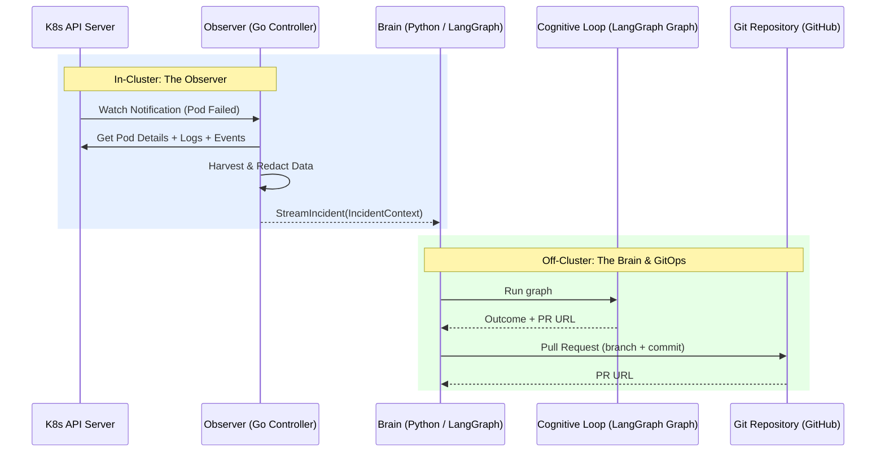
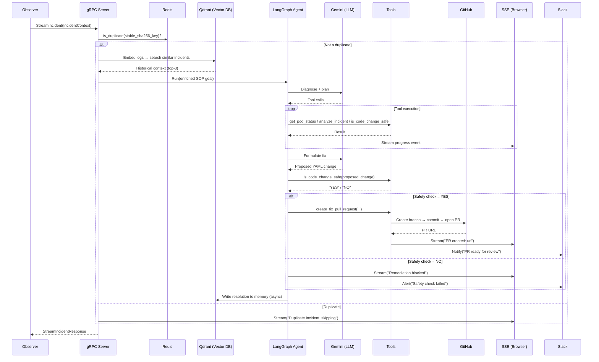

# Kube-Mind: The Autonomous SRE Platform

[](https://ci.example.com/build/status)

Kube-Mind is an AI-driven, two-part system that functions as an autonomous Level 1 Site Reliability Engineer for Kubernetes. It automatically detects, diagnoses, and proposes version-controlled fixes for common workload failures — transforming incident response from a manual, reactive process into a proactive, automated workflow.

## Brain Refactor: .NET → Python LangGraph

> **Active migration in progress** (`KM-MIGRATE-01`)

The Brain component is being migrated from **.NET 8 + Microsoft Semantic Kernel** to **Python 3.12 + LangGraph + FastAPI**. The Go Observer is **not changed** — its gRPC contract, Protobuf definitions, and Helm charts remain identical. Only the `grpc.serverAddress` Helm value will be updated to point at the new Python service.

| Layer | Before | After |
|---|---|---|
| Runtime | .NET 8 / ASP.NET Core | Python 3.12 + asyncio |
| AI Orchestration | Microsoft Semantic Kernel v1.70 | LangGraph 0.2.x |
| LLM | Gemini 2.5-pro (SK Google connector) | Gemini 2.5-pro (`langchain-google-vertexai`) |
| Embeddings | Vertex AI `text-embedding-004` (SK) | Vertex AI `text-embedding-004` (LangChain) |
| gRPC Server | Grpc.AspNetCore | `grpcio` + generated stubs |
| HTTP Server | ASP.NET Core | FastAPI + Uvicorn |
| Real-time streaming | SignalR (WebSocket) | Server-Sent Events (`sse-starlette`) |
| Vector DB client | SK Qdrant connector | `qdrant-client` (async) |
| Redis client | StackExchange.Redis | `redis-py` (async) |
| GitHub | Octokit.NET | PyGithub |
| Logging | Serilog | structlog (JSON) |
| Observability | OpenTelemetry .NET SDK | `opentelemetry-sdk` + FastAPI instrumentation |

The legacy `.NET` Brain lives in `/brain` and remains functional during the cutover period. All new development happens in `/brain-python`.

---

## Table of Contents

- [Core Concepts](#-core-concepts)
- [Architectural Overview](#-architectural-overview)
- [The Cognitive Loop](#-the-cognitive-loop)
- [Getting Started](#-getting-started)
  - [Prerequisites](#prerequisites)
  - [Configuration](#configuration)
  - [Running the Platform](#running-the-platform)
- [Project Structure](#-project-structure)
- [Contributing](#-contributing)

## Core Concepts

The platform is composed of two primary microservices that work in concert:

1. **The Observer (Go):** A lightweight, read-only Kubernetes controller that resides within your cluster. It continuously watches for workload failures (`CrashLoopBackOff`, `OOMKilled`, etc.), harvests diagnostic data (logs, manifests, events), redacts sensitive information, and streams an `IncidentContext` payload to the Brain via gRPC.

2. **The Brain (Python):** A centralized AI orchestration service. It ingests incidents from the Observer, runs a LangGraph agent powered by Gemini to diagnose the failure, validates any proposed fix through a safety gate, and opens a merge-ready GitHub Pull Request. Live progress is streamed to a browser UI via Server-Sent Events.

## Architectural Overview

The system is built around a principle of least privilege and uncompromising safety. The Observer has read-only cluster access. The Brain **never** writes to the cluster directly — all proposed changes go through a GitOps Pull Request workflow requiring human approval.

### End-to-End System Flow


```mermaid
sequenceDiagram
    participant K8s API Server
    participant Observer (Go Controller)
    participant Brain (Python / LangGraph)
    participant Cognitive Loop (LangGraph Graph)
    participant Git Repository (GitHub)

    rect rgb(230, 240, 255)
        note over K8s API Server, Observer (Go Controller): In-Cluster: The Observer
        K8s API Server->>Observer (Go Controller): Watch Notification (Pod Failed)
        Observer (Go Controller)->>K8s API Server: Get Pod Details + Logs + Events
        Observer (Go Controller)->>Observer (Go Controller): Harvest & Redact Data
        Observer (Go Controller)-->>Brain (Python / LangGraph): StreamIncident(IncidentContext)
    end

    rect rgb(230, 255, 230)
        note over Brain (Python / LangGraph), Git Repository (GitHub): Off-Cluster: The Brain & GitOps
        Brain (Python / LangGraph)->>Cognitive Loop (LangGraph Graph): Run graph
        Cognitive Loop (LangGraph Graph)-->>Brain (Python / LangGraph): Outcome + PR URL
        Brain (Python / LangGraph)->>Git Repository (GitHub): Pull Request (branch + commit)
        Git Repository (GitHub)-->>Brain (Python / LangGraph): PR URL
    end
```

## The Cognitive Loop

The Brain runs a LangGraph directed graph for every non-duplicate incident:


```mermaid
sequenceDiagram
    participant Observer
    participant gRPC Server
    participant Redis
    participant Qdrant (Vector DB)
    participant LangGraph Agent
    participant Gemini (LLM)
    participant Tools
    participant GitHub
    participant SSE (Browser)
    participant Slack

    Observer->>gRPC Server: StreamIncident(IncidentContext)
    gRPC Server->>Redis: is_duplicate(stable_sha256_key)?
    alt Not a duplicate
        gRPC Server->>Qdrant (Vector DB): Embed logs → search similar incidents
        Qdrant (Vector DB)-->>gRPC Server: Historical context (top-3)
        gRPC Server->>LangGraph Agent: Run(enriched SOP goal)

        LangGraph Agent->>Gemini (LLM): Diagnose + plan
        Gemini (LLM)-->>LangGraph Agent: Tool calls

        loop Tool execution
            LangGraph Agent->>Tools: get_pod_status / analyze_incident / is_code_change_safe
            Tools-->>LangGraph Agent: Result
            LangGraph Agent->>SSE (Browser): Stream progress event
        end

        LangGraph Agent->>Gemini (LLM): Formulate fix
        Gemini (LLM)-->>LangGraph Agent: Proposed YAML change

        LangGraph Agent->>Tools: is_code_change_safe(proposed_change)
        Tools-->>LangGraph Agent: "YES" / "NO"

        alt Safety check = YES
            LangGraph Agent->>Tools: create_fix_pull_request(...)
            Tools->>GitHub: Create branch → commit → open PR
            GitHub-->>Tools: PR URL
            Tools->>SSE (Browser): Stream("PR created: url")
            Tools->>Slack: Notify("PR ready for review")
        else Safety check = NO
            LangGraph Agent->>SSE (Browser): Stream("Remediation blocked")
            LangGraph Agent->>Slack: Alert("Safety check failed")
        end

        LangGraph Agent->>Qdrant (Vector DB): Write resolution to memory (async)
    else Duplicate
        gRPC Server->>SSE (Browser): Stream("Duplicate incident, skipping")
    end
    gRPC Server-->>Observer: StreamIncidentResponse
```

### Graph Nodes

| Node | Responsibility |
|---|---|
| `deduplicate` | Redis `SET NX` with 5-min TTL — skips already-processing incidents |
| `enrich` | Vertex AI embed → Qdrant cosine search → inject top-3 past resolutions as context |
| `agent` | Gemini + SOP Jinja2 prompt; emits tool calls |
| `tools` | Executes tool calls; loops back to `agent` until no more calls |
| `route` | Reads `safety_result`; branches to `write_memory` or `safety_blocked` |
| `write_memory` | Enqueues resolution to background Qdrant writer |
| `safety_blocked` | Fires Slack alert; sets `outcome = "blocked"` |

### Tools Available to the Agent

| Tool | What it does |
|---|---|
| `get_pod_status` | Live Kubernetes API query — returns phase, conditions, restart count |
| `analyze_incident` | Secondary Gemini call with diagnostics SOP — returns `{rootCause, confidence, recommendedAction}` |
| `is_code_change_safe` | Safety gate — Gemini evaluates whether a YAML change is structural (NO) or value-only (YES) |
| `create_fix_pull_request` | GitHub: new branch → commit fix file → open PR → Slack notification |

---

## Getting Started

### Prerequisites

- **Python 3.12+**
- **Go 1.22+** (Observer only)
- **Docker + Docker Compose**
- **Redis** (deduplication, 5-min TTL)
- **Qdrant** (vector memory, port 6334)
- **GCP project** with Vertex AI API enabled
- `kubectl` + a configured Kubernetes cluster (kind, minikube, or Docker Desktop)

### Configuration

1. Navigate to the Python Brain:
   ```bash
   cd brain-python
   ```

2. Copy the example environment file:
   ```bash
   cp .env.example .env
   ```

3. Set the required and optional values in `.env`:

   ```dotenv
   # Required
   GCP_PROJECT_ID=your-gcp-project-id

   # Optional — defaults shown
   GCP_LOCATION=us-central1
   GEMINI_MODEL_ID=gemini-2.5-pro
   REDIS_URL=redis://localhost:6379
   QDRANT_HOST=localhost
   QDRANT_PORT=6334
   GITHUB_TOKEN=your-github-pat
   GITHUB_DEFAULT_REPO_OWNER=your-org
   GITHUB_DEFAULT_REPO_NAME=your-infra-repo
   SLACK_WEBHOOK_URL=https://hooks.slack.com/...
   GRPC_PORT=50051
   HTTP_PORT=5081
   LOG_LEVEL=INFO
   ```

4. Authenticate with GCP (Application Default Credentials):
   ```bash
   gcloud auth application-default login
   ```

### Running the Platform

1. **Start infrastructure dependencies:**
   ```bash
   docker run -d --name redis -p 6379:6379 redis:7
   docker run -d --name qdrant -p 6334:6334 qdrant/qdrant
   ```

2. **Install Python dependencies:**
   ```bash
   cd brain-python
   pip install poetry
   poetry install
   ```

3. **Generate gRPC bindings** (only needed after `.proto` changes):
   ```bash
   make proto
   ```

4. **Run the Brain:**
   ```bash
   make run
   # or directly:
   poetry run python -m src.main
   ```

   The Brain starts two servers:
   - gRPC on port `50051` (receives incidents from the Observer)
   - HTTP on port `5081` (SSE stream + health check + UI)

5. **View the live event stream:**
   Open `http://localhost:5081/ui` in a browser, enter an `incident_id`, and click **Connect** to watch the agent work in real time.

6. **Run tests:**
   ```bash
   make test-unit        # unit tests only (no external services needed)
   make test             # full suite including integration tests
   ```

7. **Deploy the Observer** (Go service):
   ```bash
   cd observer
   # See observer/README.md for cluster deployment instructions
   ```

---

## Project Structure

```
/
├── /brain                # Legacy .NET Brain (Semantic Kernel) — cutover pending
│   ├── src/              # ASP.NET Core source
│   └── tests/            # .NET unit + integration tests
│
├── /brain-python         # Active Brain — Python + LangGraph (KM-MIGRATE-01)
│   ├── src/
│   │   ├── main.py                    # Entrypoint: boots gRPC + HTTP servers
│   │   ├── config.py                  # Pydantic Settings (all env-var config)
│   │   ├── utils.py                   # GCP credential validation
│   │   ├── grpc_server.py             # gRPC IncidentService implementation
│   │   ├── http_server.py             # FastAPI: /healthz, /events/{id}, /ui
│   │   ├── graph/
│   │   │   ├── state.py               # IncidentGraphState TypedDict
│   │   │   ├── graph.py               # Compiled LangGraph StateGraph
│   │   │   └── nodes.py               # deduplicate, enrich, write_memory, safety_blocked
│   │   ├── tools/
│   │   │   ├── kubernetes_tool.py     # get_pod_status
│   │   │   ├── diagnostics_tool.py    # analyze_incident
│   │   │   ├── polycheck_tool.py      # is_code_change_safe
│   │   │   └── gitops_tool.py         # create_fix_pull_request
│   │   ├── services/
│   │   │   ├── deduplication.py       # Redis SET NX dedup
│   │   │   ├── enrichment.py          # Vertex AI embed → Qdrant search
│   │   │   ├── memory_consolidation.py# Background Qdrant write-behind worker
│   │   │   ├── event_bus.py           # Per-incident asyncio queue (→ SSE)
│   │   │   ├── github_service.py      # PyGithub: branch + commit + PR
│   │   │   └── slack_service.py       # Slack webhook notifications
│   │   └── observability/
│   │       ├── logging_config.py      # structlog JSON configuration
│   │       └── tracing.py             # OpenTelemetry + OTLP exporter
│   ├── tests/
│   │   ├── unit/                      # Hermetic unit tests (no external services)
│   │   └── integration/               # Full-stack tests (requires Redis + Qdrant)
│   ├── generated/                     # Auto-generated gRPC stubs (do not edit)
│   ├── prompts/sop.j2                 # Jinja2 SOP prompt template
│   ├── static/index.html              # SSE live event viewer UI
│   ├── pyproject.toml                 # Poetry dependencies
│   └── Makefile                       # proto / install / lint / test / run targets
│
├── /observer             # Go Observer (unchanged by this migration)
│   ├── internal/         # Controller logic, harvesting, redaction
│   └── cmd/              # Main entry point
│
├── /deploy
│   ├── /helm             # Helm charts for Observer and Brain
│   └── /tests            # RBAC policy CI tests
│
├── /docs                 # PRDs and architecture documents
│   ├── langgraph-migration-prd.md   # KM-MIGRATE-01 (this refactor)
│   ├── system-overview-prd.md       # Platform-level requirements
│   ├── orchestrator-prd.md          # Original .NET Brain PRD (superseded)
│   └── controller-prd.md            # Observer PRD
│
└── /proto                # Shared Protobuf definitions (unchanged)
    └── incident.proto
```

## Contributing

Contributions are welcome. Please open an issue or submit a pull request against `main`. See `docs/CONTRIBUTING.md` for guidelines.

For the Brain migration specifically, all work is tracked under PRD `KM-MIGRATE-01` (`docs/langgraph-migration-prd.md`). New Brain features should be implemented in `/brain-python` only.
