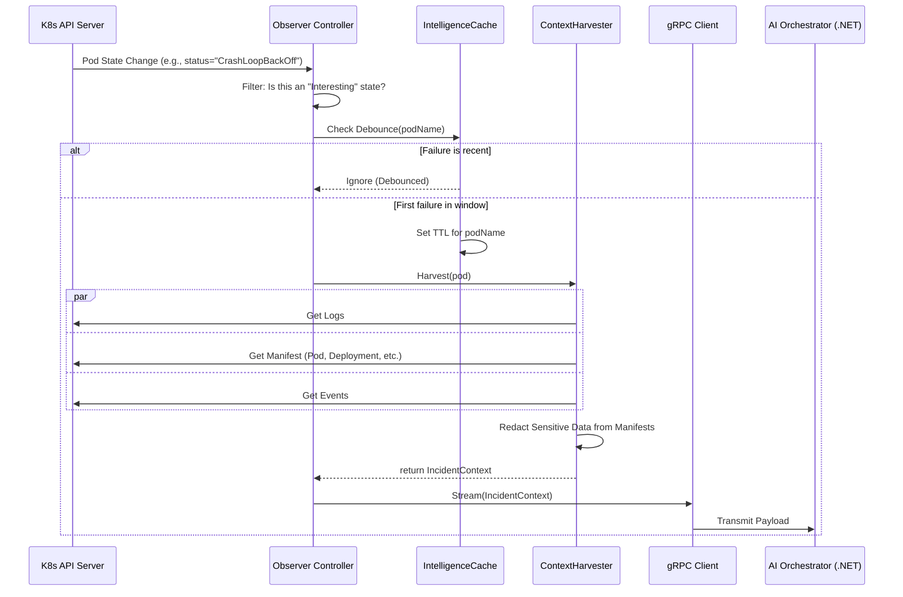

# Product Requirements Document (PRD): Kube-Mind Observer

**Project Code Name:** `KM-OBS-01`  
**Version:** 2.0.0 (Titan)
**Author:** AI Thought Partner  
**Status:** DRAFT

---

## 1. Introduction & Strategic Context

### 1.1. Problem Statement

Modern Kubernetes environments are dynamic and complex. When workloads fail, Site Reliability Engineers (SREs) and developers engage in a time-consuming, manual process of forensic analysis. They must collect logs, inspect YAML manifests, correlate Kubernetes events, and sift through disparate data sources to diagnose a root cause. This leads to high Mean Time to Resolution (MTTR), context switching, alert fatigue, and an increased risk of human error. The cognitive load required to diagnose even common failures (e.g., `CrashLoopBackOff`, `OOMKilled`) is a significant operational bottleneck, preventing teams from focusing on higher-value engineering tasks.

### 1.2. Vision & Mission

**Vision:** To create a fully autonomous Level 1 SRE for our Kubernetes infrastructure, enabling the system to heal itself from common workload failures without human intervention.

**Mission:** The **Kube-Mind Observer** will act as the "Sensory Nervous System" for a broader AI-driven S.R.E. orchestrator. It will be a high-performance, cluster-aware Go controller that detects workload failures in real-time, harvests deep technical context, and streams this intelligence to a .NET-based AI "Brain" for analysis and autonomous remediation.

### 1.3. Goals & Objectives

The primary goals for Version 2.0.0 of the Kube-Mind Observer are:

- **Goal 1: Automate Diagnostics:** Eliminate the manual effort of data collection for common pod-level failures.
  - **Objective:** Detect and harvest context for 100% of `CrashLoopBackOff`, `OOMKilled`, and `ImagePullBackOff` events across all monitored namespaces.
- **Goal 2: Reduce Time-to-Insight:** Provide the AI Brain with actionable data within seconds of a failure.
  - **Objective:** Achieve a p95 latency of **< 1000ms** from pod failure detection to gRPC transmission of the full `IncidentContext` package.
- **Goal 3: Ensure Data Security:** Guarantee that no sensitive information is exposed during the observation process.
  - **Objective:** Achieve 0 instances of unmasked secrets, tokens, or keys being transmitted to the AI Orchestrator.

---

## 2. System Architecture & Design

### 2.1. Technical Stack

- **Language & Runtime:** Go 1.22+
- **Core Framework:** `controller-runtime` (leveraging Kubebuilder for scaffolding and boilerplate).
- **Kubernetes Interaction:** `client-go` libraries for typed and dynamic API access.
- **Communication Protocol:** gRPC with Protobuf for high-performance, bi-directional, and strongly-typed data streaming.
- **Data Contract:** Model Context Protocol (MCP) v2 - a versioned, extensible, and redacted Protobuf definition.
- **Deployment & Delivery:** Docker (Distroless), Helm Charts, and ArgoCD (GitOps).
- **Observability:** Prometheus for metrics, `zap` for structured logging.

### 2.2. Architectural Diagram (Mermaid)

### 2.3. Component Deep Dive

- **Controller Core:** We use `controller-runtime` to manage the boilerplate of building a controller. It provides robust leader election for high availability, an efficient informer-based cache to reduce API server load, and a clean reconciliation loop pattern.
- **Context Harvester:** A concurrent, multi-stage pipeline responsible for gathering diagnostic data. It uses a worker pool to fetch logs, manifests, and events in parallel to meet latency requirements.
- **Intelligence Cache:** A TTL-based in-memory cache (`go-cache`) to debounce repeated failures from the same source. This prevents data storms and reduces redundant processing for flapping services. A pod failing 10 times in 5 minutes will only trigger one full context harvest.
- **Security & Redaction Engine:** A critical component that scrubs sensitive data. It uses a configurable set of regex patterns to identify and mask values associated with keys like `*_SECRET`, `*_TOKEN`, `*_KEY`, and common credential formats within environment variables and pod manifests before they are ever stored or transmitted.
- **gRPC Client:** A resilient client responsible for communicating with the .NET AI Orchestrator. It implements exponential backoff for reconnections, TLS for secure communication, and streams data using the Protobuf-defined `IncidentContext` message.

### 2.4. RBAC (Role-Based Access Control)

The controller will operate under a principle of least privilege. It requires `get`, `list`, and `watch` permissions only. **No `write` access is permitted.**

- **`ClusterRole`:**
  - `apiGroups: [""]` (core)
    - `resources: ["pods", "pods/log", "events", "configmaps"]`
    - `verbs: ["get", "list", "watch"]`
  - `apiGroups: ["apps"]`
    - `resources: ["deployments", "replicasets"]`
    - `verbs: ["get", "list", "watch"]`

---

## 3. Detailed Implementation Plan & Roadmap

### Phase 1: Foundation & Scaffolding

**Goal:** A stable Go binary that can connect to a cluster and react to basic pod state changes.

| Task                          | Sub-tasks                                                                 | Definition of Done (DoD)                                                                |
| :---------------------------- | :------------------------------------------------------------------------ | :-------------------------------------------------------------------------------------- |
| **1.1 Project Init**          | • Init Go modules • Scaffold with `kubebuilder`                        | `main.go` runs and connects to a local `kind` cluster without errors.                   |
| **1.2 RBAC Setup**            | • Define ClusterRoles/RoleBindings • Generate YAML manifests           | Controller pod starts and its logs show successful watches on pods and deployments (no 403s). |
| **1.3 Basic Reconcile Loop**  | • Implement `Reconcile` func for Pods • Filter for non-Running states  | Terminal logs show "Pod [Name] entered CrashLoopBackOff" in real-time.                   |
| **1.4 Controller Config**     | • Create `ConfigMap` structure • Implement loading logic via Viper      | Controller loads settings (log level, debounce TTL) from a mounted `ConfigMap` on startup. |

### Phase 2: The Context Harvester

**Goal:** Transform raw failure signals into high-fidelity, redacted diagnostic packages.

| Task                        | Sub-tasks                                                                   | Definition of Done (DoD)                                                              |
| :-------------------------- | :-------------------------------------------------------------------------- | :------------------------------------------------------------------------------------ |
| **2.1 Log Aggregator**      | • Implement `GetLogs()` via `client-go` • Parameterize `tailLines`         | A unit-tested function returns the last 200 lines of logs from a specified container. |
| **2.2 Manifest Parser**     | • Fetch and serialize Pod/Deployment specs • Implement Redaction engine     | A JSON representation of a pod is generated with all env vars matching `*_SECRET` masked as `[REDACTED]`. |
| **2.3 Intelligence Cache**  | • Integrate `go-cache` library • Implement debouncing logic in reconciler | A unit test proves that 10 reconciliation triggers in 1 minute result in only 1 harvest action. |

### Phase 3: The Communication Bridge (gRPC)

**Goal:** Establish high-speed, typed, and resilient integration with the .NET Orchestrator.

| Task                     | Sub-tasks                                                                     | Definition of Done (DoD)                                                                     |
| :----------------------- | :---------------------------------------------------------------------------- | :------------------------------------------------------------------------------------------- |
| **3.1 Contract (Proto)** | • Define `IncidentContext` message • Generate Go/C# bindings with `protoc`  | A `kube-mind.proto` file exists and compiles successfully for both Go and C# projects.       |
| **3.2 gRPC Client**      | • Implement client with mTLS & reconnect backoff • Add health checks        | The Go controller successfully sends a test message to a mock .NET server and auto-reconnects if the server is restarted. |
| **3.3 Event Streaming**  | • Integrate Harvester output with gRPC client • Stream full context payloads | A test in `kind` shows a pod crash resulting in the .NET server receiving a message containing logs, redacted YAML, and failure metadata. |

### Phase 4: Production Readiness & Ops

**Goal:** A secure, efficient, and deployable production artifact.

| Task                    | Sub-tasks                                                              | Definition of Done (DoD)                                                                  |
| :---------------------- | :--------------------------------------------------------------------- | :---------------------------------------------------------------------------------------- |
| **4.1 Dockerization**   | • Multi-stage Distroless build • Run as non-root user • Add liveness/readiness probes | Final Docker image is < 50MB, passes `trivy` scan with no critical CVEs, and runs successfully in the cluster. |
| **4.2 Helm Chart**      | • Create Chart templates for all resources • Parameterize `values.yaml` | `helm install km-observer .` successfully deploys the controller, RBAC, and ConfigMap. |
| **4.3 GitOps Sync**     | • Define ArgoCD Application manifest • Add to App-of-Apps repository    | The controller is visible, healthy, and synced in the ArgoCD dashboard.                   |
| **4.4 Monitoring**      | • Expose Prometheus metrics (`/metrics`) • Implement structured logging (`zap`) | A Grafana dashboard can query reconciliation latency and error rates from the controller. |

---

## 4. Non-Functional Requirements (NFRs)

- **Performance:**
  - **Latency:** End-to-end detection to transmission must be **< 1000ms (p95)**.
  - **API Load:** The controller must not place undue load on the K8s API Server, leveraging its cache for all read-heavy operations.
- **Resource Footprint:**
  - **Memory:** Controller pod memory usage must remain **< 128Mi RAM**.
  - **CPU:** Controller pod CPU usage must remain **< 250m CPU** under normal cluster churn.
- **Security & Safety:**
  - **RBAC:** The controller must run with the minimal set of read-only permissions required.
  - **Data Redaction:** The redaction engine must be fail-safe. If redaction fails, the context is not sent.
  - **Image:** The runtime image must be minimal (Distroless) and free of known high/critical vulnerabilities.
- **Reliability:**
  - **High Availability:** The controller must be deployed in an HA configuration (2+ replicas) with leader election enabled.
  - **Resilience:** The gRPC client must handle network partitions and server unavailability gracefully, with automatic reconnection logic.

---

## 5. Success Metrics & KPIs

- **Capture Rate:** 100% of in-scope pod failures (e.g., `CrashLoopBackOff`) are detected and trigger a harvest.
- **Data Integrity:** 0 instances of unmasked secrets are found in the logs of the AI Orchestrator.
- **E2E Latency:** The p95 latency from K8s event timestamp to AI Orchestrator ingestion is < 1000ms.
- **Controller Stability:** 99.99% uptime of the controller pods.
- **Adoption:** Number of incidents per week successfully processed by the AI Brain, based on context from the Observer.

---

## 6. Out of Scope / Future Work

- **Version 2.0 will not include:**
  - Remediation actions (this is the responsibility of the AI Brain).
  - Support for `StatefulSets`, `DaemonSets`, or other workload types.
  - Advanced context gathering like network tracing, application profiling, or dependency mapping.
  - Bi-directional communication (receiving commands from the AI Brain).
- **Future considerations (`v2.1+`):**
  - Expanding watch to other resource types.
  - A pluggable "collector" interface to allow for custom data gathering strategies.
  - Service-to-service dependency analysis based on K8s `Service` and `Ingress` objects.