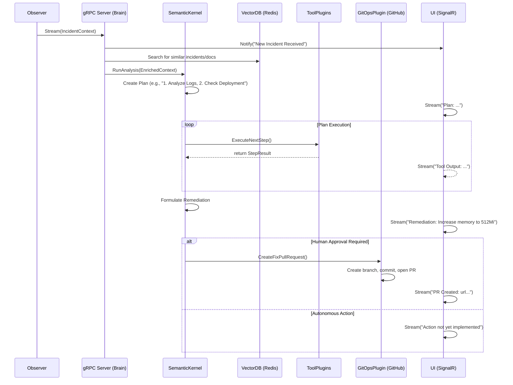

# Product Requirements Document (PRD): Kube-Mind Brain

**Project Code Name:** `KM-BRN-01`  
**Version:** 2.0.0 (Titan)
**Author:** AI Thought Partner  
**Status:** DRAFT

---

## 1. Introduction & Strategic Context

### 1.1. Problem Statement

While the Kube-Mind Observer excels at data collection, raw telemetry is only the first step. The critical bottleneck in incident response is the cognitive load on human operators to interpret that data, diagnose the root cause, and formulate a correct, safe, and version-controlled fix. This "analysis paralysis" consumes valuable SRE time, prolongs outages, and often involves repetitive investigation of common problems. The manual translation of a diagnosis (e.g., "the container needs more memory") into a precise infrastructure change (e.g., a Git commit to a Helm values file) is error-prone and slow.

### 1.2. Vision & Mission

**Vision:** To create an autonomous SRE agent that not only diagnoses but also proposes and executes safe, version-controlled remediations for our Kubernetes workloads, transforming our operations from reactive to proactive.

**Mission:** The **Kube-Mind Brain** will serve as the cognitive core of the Kube-Mind ecosystem. It will ingest real-time incident context from Observers, use advanced AI orchestration via **Microsoft Semantic Kernel** to reason about failures, learn from internal documentation and past incidents, and interact with our engineering ecosystem (Git, collaboration platforms) to close the loop on incident response.

### 1.3. Goals & Objectives

- **Goal 1: Automate Root Cause Analysis:** Move beyond data collection to automated interpretation and diagnosis.
  - **Objective:** For 75% of incidents received from the Observer, automatically generate a high-confidence root cause hypothesis with supporting evidence from the provided context.
- **Goal 2: Implement "GitOps-Native" Remediation:** Ensure all fixes adhere to established engineering best practices.
  - **Objective:** Generate correct, merge-ready Pull Requests for at least 3 common failure classes (e.g., OOMKilled memory bump, ImagePullBackOff image tag correction, CrashLoop config env var update).
- **Goal 3: Deliver Radical Transparency:** Create a "glass box" AI where every step of its reasoning is auditable and understandable by human engineers.
  - **Objective:** Stream 100% of the AI's thought process (plan generation, tool execution, and final reasoning) to a real-time UI and structured logs for every incident processed.

---

## 2. System Architecture & Design

### 2.1. Technical Stack

- **Framework:** .NET 9/10 (ASP.NET Core Web API) using a minimal, vertical slice architecture.
- **AI Orchestration:** **Microsoft Semantic Kernel (SK)** for its robust planning, plugin architecture, and memory connectors.
- **AI Models:** Pluggable interface for GPT-4o, Claude 3, Llama3, or other compatible models.
- **Communication:**
  - **Ingress:** gRPC for high-throughput, typed `IncidentContext` ingestion from Observers.
  - **Egress:** SignalR (WebSockets) for streaming the AI's thought process to a UI.
- **Cognitive Memory:** Redis with the `RediSearch` (Vector Search) module for long-term storage and retrieval of incident embeddings and remediation patterns.
- **Tooling/Ecosystem Integration:**
  - **GitOps:** `Octokit.NET` for programmatic interaction with GitHub (branching, PRs).
  - **Notifications:** Pluggable clients for Slack and Microsoft Teams webhooks.
- **Observability:** OpenTelemetry for distributed tracing/metrics, and Serilog for structured, queryable logging.

### 2.2. Architectural Diagram (Mermaid)

### 2.3. The Cognitive Loop

The Brain operates on a continuous cognitive loop for each incident:

1.  **Ingest & Enrich:** The gRPC server receives the `IncidentContext`. It immediately queries the Redis vector database for semantically similar past incidents and relevant runbook snippets.
2.  **Reason & Plan:** The enriched context is passed to the Semantic Kernel. A carefully engineered prompt asks the LLM to form a hypothesis and a step-by-step plan to verify it. The Kernel's `SequentialPlanner` or `StepwisePlanner` materializes this into a series of required tool calls (`Plugin` functions).
3.  **Execute & Gather:** The Kernel invokes the necessary C# functions (Plugins). These tools can perform actions like deeper log analysis, fetching live resource state (via a read-only K8s client), or querying internal documentation. The output of each tool is fed back into the Kernel for the next reasoning step.
4.  **Remediate & Propose:** Once the diagnosis is confirmed, the Kernel selects the appropriate remediation strategy. For this version, it will always invoke the `GitOpsPlugin`. This plugin is responsible for checking out the relevant Git repository, creating a new branch, programmatically applying the fix (e.g., updating a `values.yaml` or Kustomize patch), and opening a Pull Request with a detailed summary of its findings.
5.  **Report & Stream:** Every single step—the initial plan, each tool invocation, its result, and the final conclusion—is formatted into a human-readable string and streamed via SignalR to the UI, providing a live, transparent audit trail of the AI's "thoughts".

### 2.4. AI Safety & Guardrails

- **Primacy of GitOps:** The Brain will **never** have direct `write` or `patch` access to the Kubernetes API. All changes are advisory and must pass through the existing human-in-the-loop GitOps PR process.
- **Action Scoping:** Plugins will be narrowly scoped. For example, the `GitOpsPlugin` can only modify files within specific, whitelisted repository paths. It cannot approve its own PRs.
- **Remediation Validation ("Polycheck"):** Before committing a fix, the proposed code change is passed to a second, independent LLM (often a smaller, faster model) with a simple prompt: "Does this code look safe? Does it contain any destructive actions? Answer YES or NO." If the answer is not a definitive YES, the process is halted and escalated to a human.
- **Cost Control & Rate Limiting:** All external LLM calls are routed through a central service with token-bucket rate limiting and a circuit breaker tied to a budget ceiling to prevent runaway costs.

---

## 4. Detailed Implementation Plan & Roadmap

### Phase 1: The Intake & AI Foundation

**Goal:** Establish the core service and basic AI reasoning capability.

| Task                  | Sub-tasks                                                                       | Definition of Done (DoD)                                                                 |
| :-------------------- | :------------------------------------------------------------------------------ | :--------------------------------------------------------------------------------------- |
| ✅ **1.1 gRPC Service**  | • Implement `IncidentService` from `.proto` • Setup Proto code-gen for C#    | The service logs incoming Observer payloads to a Serilog sink.                           |
| ✅ **1.2 Kernel Config** | • Register `Kernel` with AI Connectors via DI • Create a `/healthz` endpoint | The `/healthz` endpoint returns 200 and confirms successful API connectivity to the LLM. |
| ✅ **1.3 Observability** | • Add OpenTelemetry middleware & exporters • Configure Serilog for structure | An incoming gRPC call generates a distributed trace visible in Jaeger/Zipkin.            |

### Phase 2: Cognitive Skills & Memory

**Goal:** Empower the AI to understand Kubernetes failures and learn from past data.

| Task                          | Sub-tasks                                                                        | Definition of Done (DoD)                                                                                                              |
| :---------------------------- | :------------------------------------------------------------------------------- | :------------------------------------------------------------------------------------------------------------------------------------ |
| ✅ **2.1 K8s Diagnostic Plugin** | • Create `K8sDiagnosticsPlugin` • Engineer prompts for log/manifest analysis  | The agent can be prompted with an `IncidentContext` and return a structured JSON diagnosis with >90% accuracy on test data.           |
| ✅ **2.2 Vector Memory**         | • Implement `IMemoryStore` using Redis • Create a seeding script for runbooks | The agent, when presented with a known error, includes a "similar past incident" link in its analysis.                                |
| ✅ **2.3 Auto-Function Calling** | • Map C# methods to `KernelFunction` • Configure auto-invocation planner      | The agent automatically calls a `KubernetesPlugin.GetPodStatus` function when its plan requires it, without being explicitly told to. |
| ✅ **2.4 Cognitive Enrichment**  | • Create embeddings from `IncidentContext` • Query Redis for similar documents • Inject retrieved context into planner prompt | The `goal` passed to the planner now contains a section with "similar past incidents" or "relevant runbooks" retrieved from the vector store. |

### Phase 3: The Remediation Loop (GitOps)

**Goal:** Close the loop by translating diagnoses into concrete, version-controlled infrastructure changes.

| Task                        | Sub-tasks                                                                                 | Definition of Done (DoD)                                                                               |
| :-------------------------- | :---------------------------------------------------------------------------------------- | :----------------------------------------------------------------------------------------------------- |
| ✅ **3.1 GitOps Plugin**       | • Implement `GitHubPlugin` using `Octokit.NET` • Logic for branch creation & PR filing | Given a target repo and a file change, the system successfully opens a PR in a test GitHub repository. |
| ✅ **3.2 Real-time UI Stream** | • Implement a SignalR Hub • Integrate SK hooks to stream planner/function events       | A basic web UI displays a live, formatted log of "Agent is thinking...", "Agent is calling tool X...". |
| ✅ **3.3 Approval Workflow**   | • Implement a "Pending Approval" state • Add Slack/Teams notification to GitOpsPlugin  | When a PR is created, a notification is posted to a test Slack channel with a link to the PR.          |

### Phase 4: Scaling & Resilience

**Goal:** Harden the Brain for enterprise-scale reliability and safety.

| Task                          | Sub-tasks                                                                               | Definition of Done (DoD)                                                                              |
| :---------------------------- | :-------------------------------------------------------------------------------------- | :---------------------------------------------------------------------------------------------------- |
| ✅ **4.1 Cost & Rate Limiting**  | • Implement token-bucket for LLM calls • Add incident de-duplication logic           | A test that sends 100 identical incidents in one minute results in only one new AI analysis workflow. |
| ✅ **4.2 Security Hardening**    | • Manage API keys via Azure Key Vault/HashiCorp Vault  | All secrets are loaded from a secure vault; no sensitive data is ever written to console logs.        |
| ✅ **4.3 "Polycheck" Guardrail** | • Implement a secondary LLM validation step • Define a schema of "Forbidden Actions" | A unit test shows that a remediation plan containing a "delete" action is successfully blocked.       |

---

## 5. Non-Functional Requirements

- **Performance:** End-to-end AI diagnosis and PR creation should be completed in **< 30 seconds (p90)**.
- **Extensibility:** Adding a new `Plugin` or `Skill` should require minimal boilerplate, discoverable via assembly scanning and DI. New Git providers or notification systems should be implementable via a clean interface.
- **Auditability & Explainability:** Every automated action must be traceable to a specific incident, a specific chain of reasoning, and the exact context used. The `Reasoning` field in every PR must be clear and concise.
- **Cost Management:** LLM and infrastructure costs must be trackable on a per-incident basis and stay within a predefined monthly budget.

---

## 6. Success Metrics

- **Mean Time to Repair (MTTR):** Target a 40% reduction in MTTR for the targeted failure classes, measured from initial alert to PR merge.
- **Remediation Accuracy:** >85% of AI-generated Pull Requests are deemed correct and mergeable by human SREs without significant modification.
- **User Trust / Approval Rate:** >90% of automated fix PRs are approved by human engineers.
- **Automation Rate:** The percentage of incidents that are fully diagnosed and have a PR generated without any human interaction. Target: 50% for in-scope failures within 6 months.
